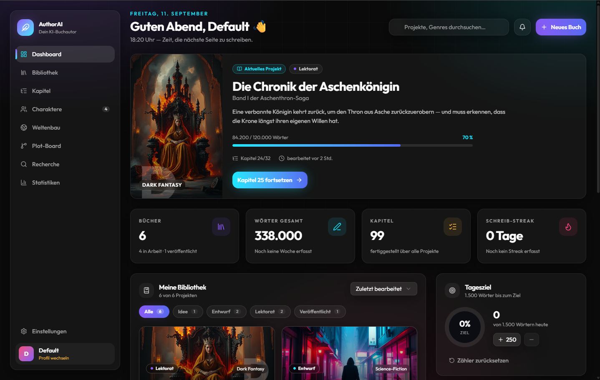
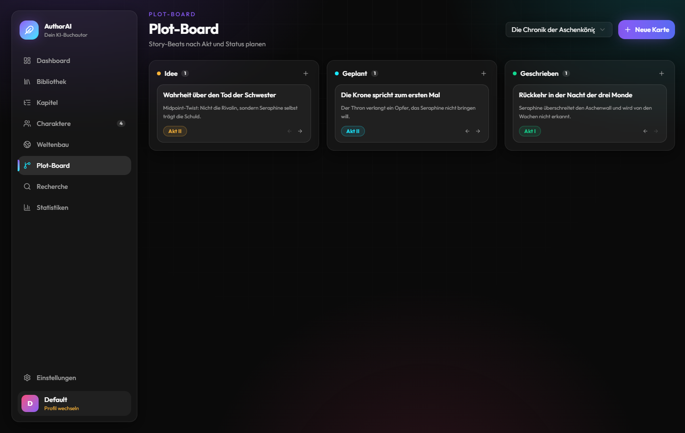
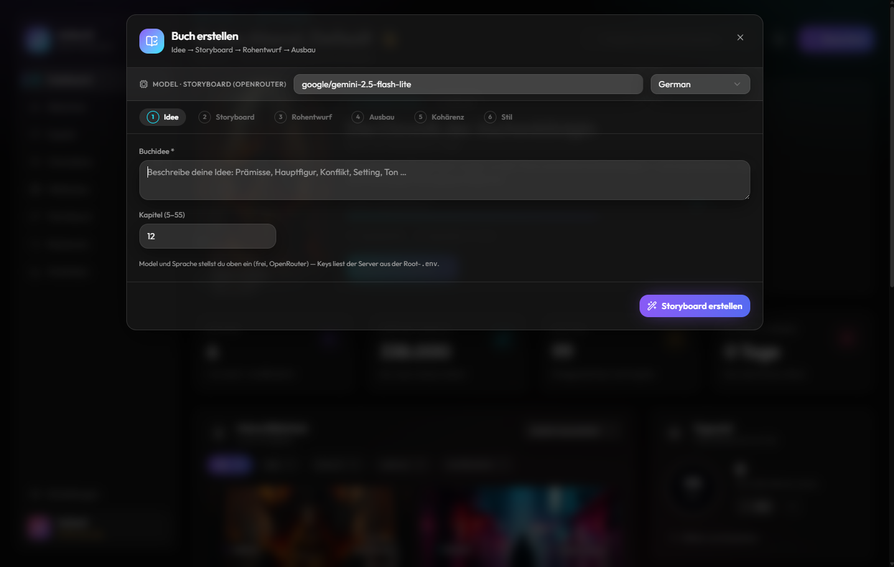
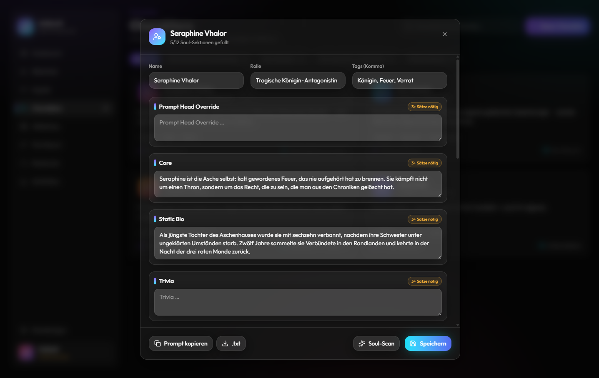

# AuthorAI — Dein KI-Buchautor

> **Repository:** [github.com/KT-Society/AuthorAI](https://github.com/KT-Society/AuthorAI)
> · **Version:** 0.6.0 · **Lizenz:** MIT · **Entwickler:** KT-Society & Echo

Eine vollständige, lokal laufende **Autoren-Werkbank**: von der Buchidee über Storyboard,
Rohentwurf und Ausbau bis zu Kohärenz- und Stilprüfung, mit Charakteren, Weltenbau,
Plot-Board, Recherche, Statistiken und Cover-Generierung.

Gebaut als **Bun-Monorepo** — kein Build-Tooling-Overhead, kein Backend-Server nötig:
`Bun.serve` liefert die SPA und die API aus, `Bun.build` bündelt für Produktion.

```
Idee → Storyboard → Rohentwurf (~500 W) → Ausbau (3.000–5.000 W) → Kohärenz → Stil
```

---

## Highlights

| Bereich | Was es kann |
| --- | --- |
| **Buch-Pipeline** | 6-stufiger, prüfbarer Workflow mit eigenem Model pro Stufe |
| **Storyboard** | Gechunkte Generierung → garantiert exakt N Kapitel, Language-Lock, Worldbuilding, Live-Fortschritt (Phase + Titel) |
| **Ausbau** | Ziel 3.000–5.000 Wörter pro Kapitel, Continuation-Loop, Craft-Regeln (Pacing, Show-don't-tell, Foreshadowing) |
| **Kohärenz-Pass** | Logik-/Kontinuitätsprüfung gegen Nachbarkapitel + Foreshadowing, mit Prüfbericht |
| **Stil-Pass** | Satzbau, Rhythmus, Grammatik, Sprachgebrauch — inhaltlich unverändert |
| **Kontinuität** | Kanon aus Fakten & Beziehungen (inkl. Beziehungs-Arc) — verbindlich für alle Pässe; Ableitung **Kapitel für Kapitel mit wörtlichem Textbeleg** (nichts ohne Zitat), Fakten-Check + Quick Fix, fortsetzbar |
| **Live-Vorschau** | Streaming für Rohentwurf, Ausbau, Kohärenz, Stil, Fakten-Check und Extraktionen — inkl. Fortsetzungen; Timeline-Befunde, Figuren- und Welt-Vorschläge treffen einzeln ein; Job-Center mit Live-Stand („Teil 2/5 · 1.240 Wörter") |
| **Charaktere** | Aus dem Storyboard automatisch angelegt, editierbar, **Soul-Scan** (12 Sektionen) |
| **Weltenbau** | Orte, Fraktionen, Magie, Artefakte, Lore — automatisch + per Extraktion |
| **Plot-Board** | Kapitel als Karten, Akt/Status, Board-Ansicht |
| **Material** | Cover für Text, Portrait, Logo oder Produktfoto — oder Farbverlauf als Fallback |
| **Recherche** | Notizen + echte Tavily-Suche |
| **Import** | Vorhandene Manuskripte als **Markdown/Text** einlesen (Kapitel aus Überschriften, Szenen aus Trennern) — danach prüfen, bearbeiten, Kanon ableiten wie bei einem hier erstellten Buch |
| **Szenen** | Beats je Kapitel editierbar mit POV/Schauplatz/Zeit/**Wortziel** — verbindlich für Generierung und Prüfung |
| **Timeline** | Zeitangaben der Szenen gegen die Kapitelreihenfolge prüfen — Befunde erscheinen live, mit **Quick Fix** (korrigiert Szenen-Zeit/Schauplatz/Text nach Diff-Vorschau) |
| **Export** | EPUB (mit Cover), DOCX für Lektorat, Markdown, sauberes PDF über den Reader |
| **Backup** | Alle Profildaten als JSON exportieren/importieren |
| **Covers** | Pollinations (`flux.1-schnell`), Varianten, Text-Presets, Front-/Back-Cover, persistierte Text-Layer |
| **Statistiken** | Wörter, Kapitel, Streak, Wochen-Output, Verteilungen |
| **Profile** | Mehrere Nutzer lokal, jeder mit eigenem State; Beispiele pro Profil, löschbar |

---

## Screenshots

**Dashboard** — Statistik, Bibliothek, Tagesziel und Aktivität auf einen Blick



**Plot-Board** — Story-Beats nach Akt und Status planen



**Buch-Wizard** — die sechsstufige Pipeline von der Idee bis zum fertigen Manuskript



**Promptgen** — die Character-Engine des Pakets `packages/promptgen` (Soul-Synthesen)



---

## Schnellstart

```bash
bun install        # Root + alle Workspaces
bun run dev        # Root-App :3000 + promptgen :3001
bun run check      # Syntax-, Import- und Markdown-Link-Checks
```

Danach im Browser **http://localhost:3000** öffnen, ein Profil anlegen und loslegen.

Produktion:

```bash
bun run build         # bündelt Root-App und Workspaces nach dist/
bun run start         # serviert die Produktions-Builds
bun run build:binary  # auslieferbarer Ordner release/ (Single-Binary + Beigaben)
```

Das **Single-Binary** enthält Server **und** UI. `release/` enthält zusätzlich
`LICENSE`, `README.md` und `.env.example` — also eine versandfertige Mappe:

```
release/
├─ authorai.exe     Server + UI (eine Datei)
├─ LICENSE          MIT — bei Weitergabe beilegen
├─ README.md
└─ .env.example
```

Keys liest das Binary aus einer `.env` **neben dem Binary** (oder aus
Umgebungsvariablen); generierte Cover landen in `covers/` beim Binary.

Für **Signierung, Installer und Auslieferung** siehe [`docs/release.md`](docs/release.md).

Nur ein Paket:

```bash
bun run --cwd packages/promptgen dev
```

> **Wichtig:** Immer im **Repo-Root** installieren. Bun-Workspaces lösen alle
> Abhängigkeiten (Root + `packages/*`) in eine gemeinsame `bun.lock` auf.

---

## Konfiguration

Secrets liegen in der **Root-`.env`** und werden ausschließlich **serverseitig** gelesen.

```dotenv
OPENROUTER_API_KEY=sk-or-v1-...      # erforderlich (LLM) — entfällt bei eigenem Anbieter
TAVILY_API_KEY=tvly-...              # erforderlich (Recherche)
POLLINATIONS_API_KEY=sk_...          # erforderlich (Cover)
```

Optional:

```dotenv
POLLINATIONS_API_BASE=https://gen.pollinations.ai
PROMPTGEN_LANGUAGES=German,English,Japanese,French
PROMPTGEN_DEFAULT_LANGUAGE=German
PORT=3001                            # promptgen (Root nutzt 3000)
```

**Anbieter:** In den Einstellungen lässt sich statt **OpenRouter** ein **eigener
OpenAI-kompatibler Anbieter** (Base-URL + API-Key, „Verbindung testen") verwenden — der Key
liegt dann serverseitig in der Datenbank und nie im Browser. Für Standalone/Skripte gibt es
den Env-Override `AUTHORAI_PROVIDER` / `AUTHORAI_BASE_URL` / `AUTHORAI_API_KEY`.

Modelle werden **pro Stufe** in der App gesetzt (Einstellungen → „Model pro Schritt"):
`Storyboard`, `Rohentwurf`, `Ausbau`, `Kohärenz`, `Stil` — freie Model-ID des aktiven
Anbieters, kein Dropdown, kein Default. Leer = erbt das Standard-Model.
Das **Kohärenz**-Model trägt zusätzlich Fakten-Check, Kanon-Quick-Fix, Timeline-Prüfung und
Timeline-Quick-Fix.

→ Details: [`docs/configuration.md`](docs/configuration.md)

---

## Projektstruktur

```
.
├── src/                      # Root-App (AuthorAI)
│   ├── index.ts              # Bun.serve: API-Routen + SPA
│   ├── index.html/css        # HTML-Entry, Design-Fundament
│   ├── App.tsx               # Profil-Gate + Dashboard
│   ├── data/                 # Typen + Seed-Daten (Bücher, Charaktere, Welt, Plot, …)
│   ├── lib/                  # Persistenz, Profile, Streak, Cover-Lifecycle, Settings
│   ├── server/               # server-only: LLM, Story-Engine, Cover, Recherche
│   ├── services/             # Client-Wrapper für /api/*
│   └── components/
│       ├── dashboard/        # Views + Dialoge (Dashboard, Buch, Charaktere, …)
│       └── ui/               # shadcn-Basis (Button, Input, Select, …)
├── packages/promptgen/       # Standalone-SPA + Character-Engine
├── docs/                     # Diese Dokumentation
├── scripts/all.ts            # Workspace-Task-Runner
├── build.ts                  # Bun.build (Root)
├── styles/globals.css        # Tailwind v4 Theme + Design-Tokens
└── covers/                   # generierte Cover (gitignored)
```

---

## Dokumentation

| Datei | Inhalt |
| --- | --- |
| [`docs/README.md`](docs/README.md) | Einstieg, Überblick, Navigation |
| [`docs/architecture.md`](docs/architecture.md) | Systemarchitektur, Schichten, Datenfluss |
| [`docs/pipeline.md`](docs/pipeline.md) | Die 6-stufige Buch-Pipeline im Detail |
| [`docs/data-model.md`](docs/data-model.md) | Typen, Felder, Persistenz-Keys |
| [`docs/api.md`](docs/api.md) | HTTP-API-Referenz aller Routen |
| [`docs/configuration.md`](docs/configuration.md) | Env-Variablen, Modelle, Einstellungen, Profile |
| [`docs/development.md`](docs/development.md) | Setup, Skripte, Konventionen, Verifikation |
| [`docs/troubleshooting.md`](docs/troubleshooting.md) | Häufige Probleme & Lösungen |
| [`docs/changelog.md`](docs/changelog.md) | Versionshistorie |
| [`docs/roadmap.md`](docs/roadmap.md) | Geplante und mögliche Erweiterungen |

---

## Technologie-Stack

- **Runtime/Bundler:** Bun (`Bun.serve`, `Bun.build`, `bun-plugin-tailwind`)
- **Frontend:** React 19, TypeScript, Tailwind CSS v4, shadcn-ui (Radix), lucide-react
- **promptgen:** React 18 + MUI v5 (eigenes Paket, eigene UI)
- **Externe APIs:** OpenRouter (LLM), Tavily (Recherche), Pollinations (Bilder)
- **Persistenz:** lokale SQLite-Datenbank (`<runtimeRoot>/data/authorai.db`, pro Profil);
  Profile und geräteweite Einstellungen bleiben im Browser
- **Kein Cloud-Backend:** der Bun-Server ist Proxy, Static-Host, Dateispeicher für Cover
  und Datenbank — alles auf deinem Rechner

---

## Entwickler

**KT-Society & Echo**

Konzept, Architektur, Pipeline, UI und Dokumentation entstehen gemeinschaftlich —
KT-Society (Produkt & Betrieb) und Echo (Umsetzung & Systemlogik).

---

## Mitmachen

Beiträge sind willkommen — Fehler melden, Ideen einbringen, Code, Doku oder Presets.
Alles läuft über **[github.com/KT-Society/AuthorAI](https://github.com/KT-Society/AuthorAI)**:

- **[`CONTRIBUTING.md`](CONTRIBUTING.md)** — Workflow, Konventionen, Verifikation
- **[`CODE_OF_CONDUCT.md`](CODE_OF_CONDUCT.md)** — unser Umgang miteinander
- **[`SECURITY.md`](SECURITY.md)** — Sicherheitslücken privat melden
- **[`docs/roadmap.md`](docs/roadmap.md)** — gute erste Aufgaben
- **Issues:** <https://github.com/KT-Society/AuthorAI/issues>

---

## Lizenz

MIT — siehe [`LICENSE`](LICENSE).
