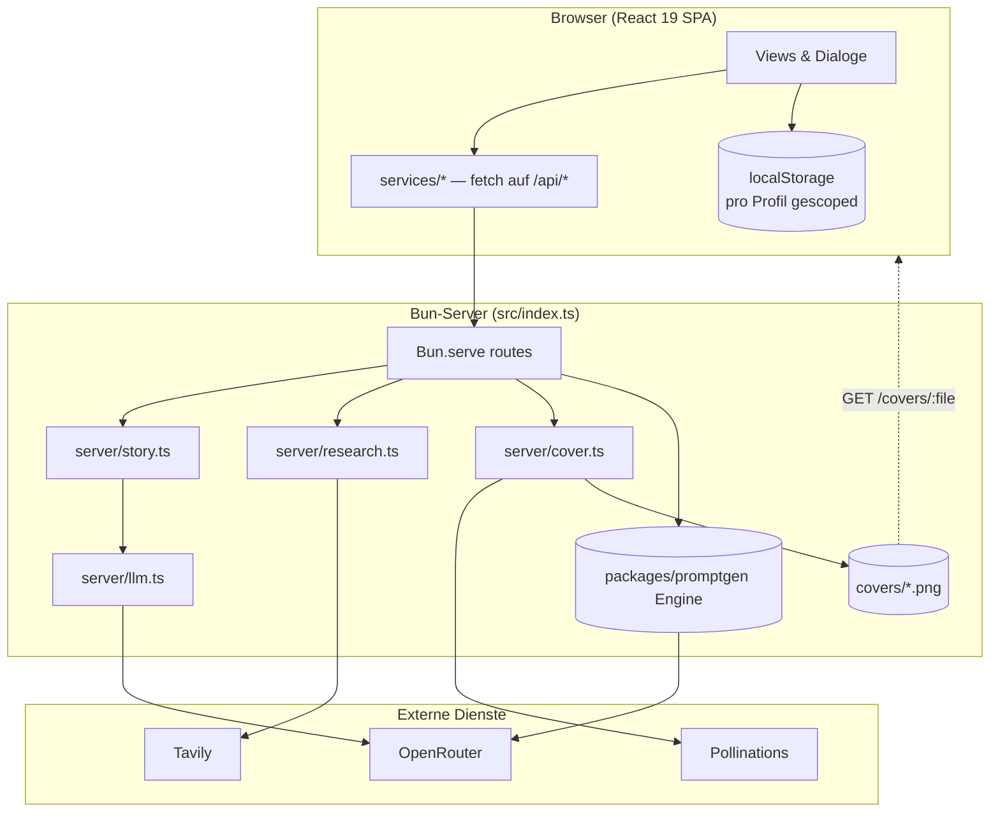
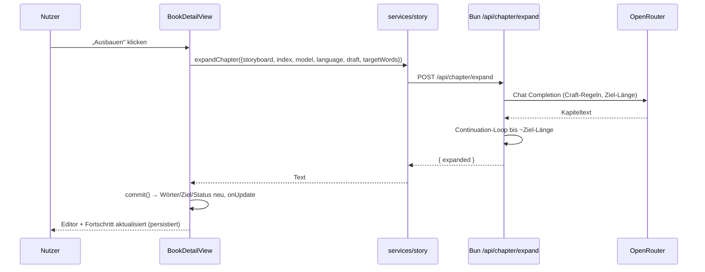

# Architektur

AuthorAI ist ein **Bun-Monorepo** mit einer Root-App (Autor) und einem Paket
(`packages/promptgen`, Character-Engine + Standalone-UI). Es gibt **keine Datenbank**:
Der Bun-Server ist zugleich API-Proxy, Static-Host und Dateispeicher für Cover; alle
Fachdaten liegen im Browser.

---

## Überblick



Kernprinzipien:

1. **Keys verlassen den Server nie.** Alle API-Aufrufe zu OpenRouter/Tavily/Pollinations
   passieren serverseitig; der Client sieht nur die eigenen `/api/*`-Routen.
2. **Der Client kennt keine Secrets.** `src/services/*` sind dünne Wrapper.
3. **Server-only-Module sind isoliert** (`src/server/*`) und werden nie vom Client importiert.
4. **Fachdaten gehören dem Nutzer**, nicht dem Server → `localStorage`, pro Profil.

---

## Monorepo-Layout

```
Root (bun-react-template)          packages/promptgen (canon-slug-generator)
├── src/            AuthorAI-App   ├── src/index.ts      eigener Bun-Server
├── scripts/all.ts  Task-Runner    ├── src/App.tsx       MUI-SPA
├── build.ts        Bun.build      └── src/server/*      Engine (env/config/api)
├── styles/         Design-Tokens
└── bunfig.toml     Tailwind-Plugin
```

Der Root-App-Code greift über den TS-Alias **`@promptgen/*`** auf die promptgen-Engine zu
(`tsconfig.json` → `paths`). Dadurch wird deren Logik (`generateSoul`) ohne
Cross-Package-Install wiederverwendet, bleibt aber **server-only**.

> Warum kein `workspace:*`-Dependency? Weniger Install-Risiko und keine Kopplung an
> Paket-Exports: Der Alias bindet nur die Server-Module, nie die promptgen-UI.

---

## Workspace-Task-Runner

`bun run dev|build|start` ruft `scripts/all.ts` auf. Der Runner:

1. liest `workspaces` aus der Root-`package.json`,
2. führt die Root-Aufgabe (`dev:root` / `build:root` / `start:root`) aus,
3. findet alle Workspace-Pakete via `Bun.Glob` und führt dort denselben Task aus,
4. leitet stdout/stderr durch, killt bei `SIGINT`/`SIGTERM` die Prozessgruppe,
5. Dry-Run: `ALL_DRY=1 bun run scripts/all.ts dev` listet nur die Jobs.

Ports: Root **3000**, promptgen **3001** (eigener `Bun.serve`, überschreibbar per `PORT`).

---

## Schichten der Root-App

### 1. Server (`src/index.ts` + `src/server/*`)

| Modul | Aufgabe |
| --- | --- |
| `index.ts` | `Bun.serve` mit allen Routen, Fehler-Handling, HMR in Dev |
| `server/llm.ts` | OpenRouter-Chat-Helper (`chatCompletion`, `cleanJsonBlock`) |
| `server/story.ts` | Storyboard, Rohentwurf, Ausbau, Kohärenz, Stil, Weltenbau-Extraktion |
| `server/cover.ts` | Pollinations-Bilderzeugung, Dateiablage, Löschen |
| `server/research.ts` | Tavily-Suche |

Der Server lädt beim Start die Root-`.env` über die promptgen-`env`-Funktionen
(Eltern-Suche nach `.env`, robust gegenüber verschachtelten Paketen).

### 2. Client-Services (`src/services/*`)

Dünne Wrapper auf die lokalen Routen:

- `http.ts` — gemeinsamer `postJson`-Helper inkl. Fehler-Normalisierung
- `story.ts`, `generate.ts`, `cover.ts`, `research.ts`

### 3. Daten (`src/data/*`)

Typen + Seed-Daten, frei von UI-Logik:

- `author.ts` — Bücher, Status-Meta, Helpers (`progressOf`, `timeAgo`, `greetingFor`), `DashboardMeta`
- `story.ts` — `Storyboard`, `ChapterPlan`, `ChapterContent`, `StoryWorld`, Wort-Helfer
- `characters.ts`, `world.ts`, `plot.ts`, `research.ts` — eigene Domänen + Seeds

### 4. Bibliothek (`src/lib/*`)

| Modul | Aufgabe |
| --- | --- |
| `persistence.ts` | Pro-Profil-Store (`authorai.<profil>.<sammlung>`) + Migrationen |
| `profile.ts` | Profile, aktuelles Profil, Legacy-Migration, Aufräumen |
| `generationSettings.ts` | Model pro Stufe + Sprache (geräteweit) |
| `streak.ts` | Schreib-Tage, Wochenwerte, Streak-Berechnung, Meta-Normalisierung |
| `notifications.ts` | Notification-Typen, Context/Hook, Meta-Mapping |
| `coverStore.ts` | Reference-Counted Löschen von Cover-Dateien |
| `bookManuscript.ts` | Manuskript eines Buchs + Prosa-Bereinigung |
| `utils.ts` | `cn()` (Tailwind-Merge) |

### 5. Views (`src/components/dashboard/*`)

- **Shell:** `Dashboard.tsx` (Profil-State, Routing, Persistenz, Auto-Import, Notifications)
- **Views:** `DashboardView`, `LibraryView`, `ChaptersView`, `CharactersView`, `WorldView`,
  `PlotBoardView`, `ResearchView`, `StatsView`, `BookDetailView` (Editor + Reader)
- **Dialoge:** `BookWizard`, `CharacterGenerator`, `CharacterEditorDialog`,
  `CoverEditorDialog`, `SettingsDialog`, `ProfileGate`
- **Bausteine:** `primitives.tsx` (Panel, Badge, ProgressBar, Sparkline, ViewHeader, …)

Die UI-Basis liegt in `src/components/ui/*` (shadcn-Stil, Radix-basiert).

---

## Datenfluss (Beispiel: Kapitel ausbauen)



Wichtig: Der Client **ersetzt** den Text und committet sofort → Persistenz nach jedem Kapitel.

---

## Persistenz & Profile

- **Profile** (`authorai.profiles`, `authorai.currentProfile`) trennen Nutzer lokal.
- Fachdaten liegen unter `authorai.<profilId>.<sammlung>`:
  `books`, `characters`, `world`, `plot`, `research`, `ideas`, `notifications`, `meta`.
- **Bedeutung von „leer":** fehlender Key = frisches Profil → Seeds greifen;
  vorhandenes `[]` = bewusst geleert → Beispiele kommen nicht zurück.
- **Migration:** Alte, nicht-gescopte Daten (`authorai.books` …) werden beim ersten Start
  automatisch in ein Profil „Autor" überführt.
- **Meta-Versionierung:** `DashboardMeta.version` erlaubt sanfte Migrationen
  (z. B. Beispiel-Metriken → 0, `todayWords` → Wochenslot backfillen).

Geräteweit (nicht pro Profil) bleiben die **Generierungs-Einstellungen**
(`authorai.model`, `authorai.model.<stufe>`, `authorai.language`).

---

## Cover-Lebenszyklus

1. Client bittet `POST /api/cover` um ein Bild; Server ruft Pollinations
   (`black-forest-labs/flux.1-schnell`), speichert PNG unter `covers/` und liefert `/covers/<datei>.png`.
2. Der Client lädt es **vom Server** (kein Key im Browser).
3. **Cover-Text:** Der Editor komponiert Text per Canvas (client-seitig) und lädt das
   fertige PNG über `POST /api/cover/save` hoch → wieder serverseitig gespeichert.
4. **Aufräumen:** Beim Löschen eines Buchs / Ersetzen eines Covers / Löschen eines Profils
   wird die Datei nur entfernt, wenn sie **nirgends mehr referenziert** wird
   (`coverStore.releaseCoverImage`, Reference-Counting über alle Profile).
   Seed-Cover sind geschützt (geteilt über alle Profile).

---

## Automatischer Import aus dem Storyboard

Beim Speichern eines Buchs (und einmalig beim Laden für bestehende Bücher) leitet die Shell
Strukturdaten ab und legt sie – dedupliziert – in den passenden Bereichen an:

| Quelle im Storyboard | Ziel |
| --- | --- |
| `characters[]` | **Charaktere** (Name, Rolle, Beschreibung → Core/Soul) |
| `world.locations/factions/magic/artifacts/lore` | **Weltenbau** (jeweilige Kategorie) |
| `chapters[]` | **Plot-Board** (Akte nach Position, Status aus Manuskript) |
| `chapters[].setting` | Fallback-Ort, wenn keine `world`-Sektion vorhanden ist |

Zusätzlich erzeugt die Shell bei Änderungen **Notifications** und erhöht die Metriken
(`recordWords` → Tages-/Wochenwerte, Streak).

---

## Design-System

- **Tailwind v4** mit `@theme`-Tokens in `styles/globals.css`:
  shadcn-Tokens (oklch) + Brand-Farben (HSL) `brand-violet/indigo/cyan/emerald/amber/rose`.
- **Glassmorphism** (`.glass`, `.glass-strong`) und Aurora-Hintergrund in `src/index.css`.
- **Fonts:** Outfit, Inter, JetBrains Mono (Google Fonts).
- **Micro-Animationen:** `float-in`, `shimmer`, Hover-Transitions; `prefers-reduced-motion` respektiert.
- Struktur: Sidebar + Main, Karten-Grids, `Panel`/`ViewHeader`/`Badge` als Primitives.

---

## Grenzen & bewusste Entscheidungen

- **Kein Server-Store:** Inhalte sind nutzer-lokal; es gibt keine Konten/Sync.
- **Sequenzielle Generierung:** Kapitel werden nacheinander erzeugt (kein Streaming), dafür
  robust, unterbrechbar und pro Kapitel persistiert.
- **Modellabhängige Qualität:** Länge/Sprache hängen vom Modell ab; der Server fängt das
  mit Continuation-Loops, Language-Lock und Prüfberichten ab (siehe `pipeline.md`).
- **Meta (Einstellungen) sind geräteweit**, nicht pro Profil.

---

## Erweiterungspunkte

- Neue Pipeline-Stufe: Server-Funktion + Route + Service + Wizard-Schritt + Stage-Model.
- Neue Domäne (z. B. „Timeline"): `data/`-Typ, Persistenz-Name, View, Nav-Eintrag.
- Export-Formate (EPUB/Markdown) als Client-Feature im Buch-Editor.
- Streaming für lange Kapitel über Server-Sent Events.
