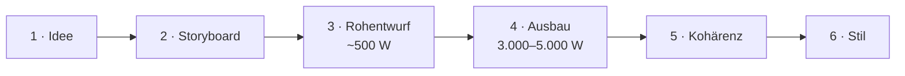

# Die Buch-Pipeline

AuthorAI erzeugt ein Buch in **sechs prüfbaren Stufen**. Jede Stufe hat ihren eigenen
Zweck, ihr eigenes Model und — bei Textstufen — einen eigenen Prüfbericht.



| # | Stufe | Model-Stage | Routen | Ergebnis |
| --- | --- | --- | --- | --- |
| 1 | Idee | — | — | Textidee + Kapitelzahl |
| 2 | Storyboard | `storyboard` | `/api/storyboard` · Stream (Fortschritt): `/api/storyboard/stream` | Struktur + Kapitelplan + Welt |
| 3 | Rohentwurf | `draft` | `/api/chapter/draft` · Stream: `/api/chapter/draft/stream` | ~500 Wörter je Kapitel |
| 4 | Ausbau | `expand` | `/api/chapter/expand` · Stream: `/api/chapter/expand/stream` | 3.000–5.000 Wörter je Kapitel |
| 5 | Kohärenz | `consistency` | `/api/chapter/consistency` · Stream: `/api/chapter/consistency/stream` | korrigierter Text + Bericht |
| 6 | Stil | `style` | `/api/chapter/style` · Stream: `/api/chapter/style/stream` | polierter Text + Bericht |

> Die Stufen 2–6 haben **je eine Streaming-Variante**: Prosa-Stufen schicken Textstücke
> (`delta`), das Storyboard meldet Phasen/Titel/Batches. Beide Wege nutzen **denselben**
> Server-Code — ohne Streaming nur ohne Callback. Details je Stufe unten.

Jede Stufe ist **einzeln und wiederholbar**: einzelnes Kapitel („Ausbauen", „Kohärenz",
„Stil") oder als Queue fürs ganze Buch („Alles ausbauen", „Alle Kohärenz", „Alle Stil").
Queues persistieren **nach jedem Kapitel** und sind damit unterbrechbar/fortsetzbar.

**Während einer Queue:** Das **Job-Center** zeigt den Fortschritt (`3/12`) und den **Live-Stand
des laufenden Kapitels** — Schritt/Haupt-Info links, Stream-Detail rechts
(„Kapitel 3 · Teil 2/5 · 1.240 Wörter" bzw. „Kapitel 2 · Ausbau · 2.400 Wörter"). Im Buch-Editor
und im Assistenten läuft parallel die **Live-Vorschau** mit dem entstehenden Text.

---

## 0 · Bestehendes Manuskript importieren

Wer schon geschrieben hat, startet nicht bei der Idee: **Bibliothek → Importieren** liest
**Markdown** (oder reinen Text) und legt daraus ein vollständiges Projekt an.

| Was | Wie |
| --- | --- |
| Kapitel | Die häufigste Überschriftsebene ist die Kapitel-Ebene; eine Überschrift darüber ist der Titel. Der eigene Export (`---` + `## Kapitel n: Titel`) wird **exakt** erkannt, ebenso der TXT-Export (`Kapitel n: Titel` als Zeile) |
| Metadaten | YAML-Frontmatter (`title`, `subtitle`, `genre`, `tags`, `synopsis`) oder die Export-Zeile `*Genre · n Wörter · n Kapitel*`; im Dialog **editierbar** vor dem Anlegen |
| Szenen | Szenentrenner (`***`, `---`, `* * *`, `— — —`) werden zu Szenen; Beat = erster Satz des Abschnitts (abschaltbar) |
| Prosa | Inline-Auszeichnung wird entfernt (`**fett**`, Links, Code), Absätze bleiben. Der Text landet in `expanded` — dort, wo alle Pässe und Exporte lesen |

Danach ist das Buch **kein Sonderfall**: Kapitelplan mit Kurzfassungen (aus dem Kapitelanfang)
füttert die Prüf-Prompts, Wortzahlen und Ziel-Wörter sind berechnet, und Figuren, Weltenbau und
Kanon lassen sich wie gewohnt ableiten. Ohne erkennbare Struktur wird der Text **ein** Kapitel
plus Hinweis — verloren geht nichts.

**Struktur nachleiten** (im Buch-Editor, für alles, was der Import nicht wissen kann):

| Aktion | Was sie tut | Route |
| --- | --- | --- |
| **„Storyboard ableiten"** | Meta-Angaben (Titel, Genre, Logline, Synopsis, Themen, Ton, POV), **Figurenliste** und je Kapitel Kurzfassung/POV/Schauplatz/Foreshadowing aus dem Manuskript | `POST /api/storyboard/derive/stream` |
| **„Szenen ableiten"** | Beats mit Zeit, Schauplatz und POV je Kapitel — einzeln im Szenen-Bereich oder für **alle** Kapitel als Job im Job-Center | `POST /api/chapter/scenes/stream` |

Beides nutzt das **Storyboard-Model**, ist **gechunkt** (Meta/Figuren, dann Kapitel in Batches à 8;
lange Kapitel in Teile von ~2.500 Wörtern) und **gestreamt** — Metadaten, Figuren, Kapitel und
Szenen treffen einzeln in der Live-Vorschau ein, der Fortschritt steht im Job-Center. Überschrieben
wird nur nach Rückfrage, und geraten wird nicht: Was der Text nicht hergibt, bleibt leer. Die
abgeleiteten Figuren landen wie beim Anlegen eines Buchs in „Charaktere", „Weltenbau" und im
Plot-Board.

---

## 1 · Idee

Freitext des Nutzers (Prämisse, Figur, Konflikt, Setting, Ton) plus Kapitelzahl (3–40)
und Ausgabesprache. Noch kein KI-Aufruf.

---

## 2 · Storyboard

Das Herz der Planung. Statt eines einzigen großen Aufrufs (der bei vielen Kapiteln
abgeschnitten wird) arbeitet der Server **zweiphasig**:

### Phase 1 — Outline
Ein kompakter JSON-Aufruf liefert Metadaten **und eine Liste von exakt N Kapiteltiteln**:

```
title, subtitle, genre, logline, synopsis, themes[], tone, pov,
characters[{name, role, description}],
world{locations[], factions[], magic[], artifacts[], lore[]},
chapterTitles[]   ← exakt N Einträge
```

- **Anzahl garantiert:** liefert das Modell weniger Titel, füllt der Server auf.
- **Language-Lock**: die Sprache wird im System *und* im User-Prompt erzwungen —
  inklusive Hinweis „nicht in späteren Abschnitten auf Englisch wechseln".
- **Closure-Regeln:** Drei-Akt-Verteilung, Klimax + Auflösung im letzten Kapitel,
  keine Filler.
- **Worldbuilding:** die `world`-Sektion macht Weltenbau (Ort/Fraktion/Magie/Artefakt/Lore)
  automatisch befüllbar.

### Phase 2 — Kapitel-Details in Batches (Größe 8)
Für jeden Batch werden Zusammenfassung, POV, Schauplatz, Beats und Foreshadowing erzeugt —
mit vollem Kontext (Titel, Logline, Synopsis, Figuren) **und der kompletten Titelliste**
zur Kontinuität. So bleibt jede Antwort klein (kein Truncation-Risiko) und die Sprache
konsistent.

Die Zuordnung erfolgt robust über den 1-basierten `index`, mit positionalem Fallback;
fehlt ein Eintrag, bleibt der Outline-Titel stehen — **die Kapitelzahl stimmt garantiert**.

**Live-Fortschritt (Streaming):** `POST /api/storyboard/stream` meldet die Phasen statt Text —
`phase` (Outline bzw. Kapitel-Details), `titles` (sobald die Titelliste feststeht), `batch`
(Zähler der Detail-Batches) und am Ende das fertige Storyboard (`done`). Text-Deltas gibt es
bewusst **nicht**: die Antworten sind JSON, rohes JSON als Vorschau wäre wertlos. Der Assistent
zeigt daraus Phase, Titelliste und einen Batch-Balken. Ohne Streaming-Variante bleibt der Lauf
unverändert (derselbe Code-Pfad, nur ohne Callbacks).

---

## 3 · Rohentwurf (≈ 500 Wörter)

Schnelle Rohfassung je Kapitel: Beats der Reihe nach, gegebener POV, Ende auf einem Hook.
Kein Feinschliff — Ziel ist Vorwärtsbewegung.

- Prompt: „Write ONLY the chapter prose", ~500 Wörter, Sprache erzwungen.
- Ergebnis wird im Manuskript als `draft` gespeichert.
- **Live-Vorschau (Streaming):** `POST /api/chapter/draft/stream` (Textstücke + fertiger Text).
  Genutzt im **Buch-Editor** und im **Assistenten** (einzeln wie „Alle Rohentwürfe"). Auch hier
  gilt: eine harte Token-Fortsetzung (`completeProse`) streamt mit.

---

## 4 · Ausbau (3.000–5.000 Wörter)

Erweitert die Rohfassung zu einem vollständigen Kapitel nach **Craft-Regeln**:

- **Pacing** (Goal → Conflict → Turn), variierender Satzrhythmus
- **Show, don't tell**, sensorische Verankerung, Subtext im Dialog
- **Foreshadowing** natürlich eingewoben, distinkte Stimmen
- kein Purple Prose, keine Filler, Ende auf Hook

**Besonderheiten**

- Ziel-Länge kommt aus den **Kapitel-Zielwörtern** (Default 3.000–5.000, im Detail einstellbar).
- **Continuation-Loop:** Modelle (besonders „lite") stoppen gern zu früh. Der Server zählt
  Wörter und fordert bis zu 3× nahtlose Fortsetzungen an, bis ≥ 90 % des Ziels erreicht sind.
- **Heading-Cleanup:** führende Markdown-Überschriften/`**Kapitel 1**`-Zeilen werden entfernt.
- **Live-Vorschau (Streaming):** `POST /api/chapter/expand/stream` schickt Textstücke
  (`delta`), am Ende den fertigen Text (`done`). Gestreamt wird **jede** Modellantwort des
  Kapitels — der erste Aufruf, die Fortsetzungen des Continuation-Loops und die abschließende
  Satz-Vervollständigung. Die Vorschau wächst deshalb bis zum Kapitelende mit (nicht nur bis zur
  ersten Antwort). Gilt für den Einzel-Ausbau **und** für „Alles ausbauen" (dort zusätzlich mit
  Kapitel-Info und Wortstand, siehe Job-Center).
- **Aufs Tagesziel:** erzeugte Wörter werden dem Tagesziel/Streak angerechnet.

---

## 5 · Kohärenz (Logik & Kontinuität)

Ein Continuity-Editor prüft das Kapitel gegen den **Storyboard-Kontext und die
Nachbarkapitel** und **korrigiert**:

- Widersprüche zu Synopsis, Figuren, vorherigem/nächstem Kapitel
- Timeline-, Orts- und Ursache-Wirkung-Fehler
- Figuren, die gegen Stimme/Motivation handeln
- ignoriertes/missbrauchtes Foreshadowing, Fallen gelassene Fäden

**Ausgabeformat** (strikt):

```
<TEXT>
...überarbeiteter Kapiteltext...
</TEXT>
<NOTES>
- kurzer Stichpunkt pro behobener Auffälligkeit
</NOTES>
```

**Parser-Robustheit:** Der Server nimmt alles ab `<TEXT>`, schneidet eine inline
`<NOTES>`/`NOTES:`-Sektion ab und entfernt Restmarker — auch wenn ein Modell das
schließende Tag vergisst. Führende Markdown-Überschriften fliegen ebenfalls raus.

**Chunking (Pflicht bei langen Kapiteln):** Der Pass muss die **vollständige** Prosa
zurückgeben. Bei 3.000–5.000 Wörtern sprengt das das Ausgabelimit vieler Modelle und die
Antwort bricht mitten im Kapitel ab (`finish_reason: length`). Deshalb zerlegt`splitIntoChunks()` das Kapitel an Absatzgrenzen in Teile von **~1.000 Wörtern**
(harte Obergrenze 1.400; überlange Absätze werden an Satzgrenzen geteilt). Jeder Teil wird
einzeln überarbeitet — mit vollem Storyboard-Kontext plus den Nachbartexten als reinem
Kontext-Anker (*„do not rewrite, do not repeat"*) — und anschließend wieder zusammengesetzt.
Das Ausgabelimit pro Teil liegt bei **4.000 Tokens**, also unter dem typischen Modell-Limit.
Gibt ein Modell trotzdem das ganze Kapitel statt des Teils zurück, wird einmal nachgefasst;
danach bricht der Pass mit klarer Meldung ab (statt Text zu duplizieren). Die `<NOTES>` aller
Teile werden gesammelt und dedupliziert.

**Live-Vorschau (Streaming):** Dieselben Pässe gibt es als SSE-Variante
(`POST /api/chapter/consistency/stream`, `…/style/stream`): je Teil kommen `part-start`,
`part-delta` und `part-done`, am Ende das vollständige Ergebnis mit den Notizen. Die Oberfläche
zeigt den Text damit beim Entstehen (inkl. „Teil 2/5"). Es ist **derselbe** Code-Pfad — nur mit
Callback statt ohne — also gelten alle Sicherungen unverändert.

Beide Aufrufer nutzen das: der **Buch-Editor** (Einzelkapitel und „Alle prüfen") und der
**Assistent** (Schritte „Kohärenz"/„Stil", einzeln und „Alle prüfen"). Auch die automatische
Fortsetzung eines am Token-Limit abgebrochenen Teils (`completeProse`) meldet ihre Textstücke
über denselben Callback — die Vorschau reißt also nicht ab.

**Schutzmechanismen** (pro Teil **und** über das Gesamtkapitel)

- **Leerer Text** → Fehler (kein Datenverlust).
- **Stark gekürzt** (< 40 % der jeweiligen Länge) → Fehler, mit Teilnummer.
- **Falscher Abschnitt** (Teil-Antwort > 160 % der Teil-Länge) → einmal nachfassen.
- **Mitten im Satz** → automatische Fortsetzung (`completeProse`).
- **No-Op-Notizen** („A" wurde zu „A") → gefiltert (`lib/passNotes.ts`); die `<NOTES>`-Regeln
  im Prompt verbieten identische Vorher/Nachher-Zitate ausdrücklich.
- **Unverändert** → Hinweis im Bericht: *„Keine Textänderung erkannt — ggf. stärkeres Modell."*

Der überarbeitete Text **ersetzt** den Kapiteltext; der Bericht wird gespeichert und
`consistencyChecked = true` gesetzt — **unabhängig davon, ob Auffälligkeiten gefunden wurden**.

---

## 6 · Stil (Satzbau & Sprachgebrauch)

Ein Line-Editor poliert **ohne** Inhalt zu verändern: Satzlänge/Rhythmus, Wiederholungen,
Füllwörter, schwache Verben, Klischees, Grammatik/Punktuation/Zeitform, Dialog-Tags.
Gleiches Format, **gleiches Chunking** und gleiche Schutzmechanismen wie die Kohärenz;
Ergebnis ersetzt den Text, `styleChecked = true`.

---

## Szenen-Vorgaben & Timeline-Prüfung

**Szenen** sind die Untereinheiten eines Kapitels: Text (der Storyboard-Beat) plus Figuren,
**POV, Schauplatz, Zeit und Wortziel**. Sie sind im Buch-Editor pflegbar und werden bei
Rohentwurf, Ausbau, Kohärenz und Stil als **verbindlicher Block** mitgeschickt:

```
SCENES (binding — follow in this order):
1. Der Aufbruch am Hafen
   POV: Kiro · Setting: Alt-Distrikt · Time: Tag 1, Morgen · Target: ~800 words
   Characters present: Kiro, Sylar
```

Die System-Prompts fordern: Reihenfolge halten, POV/Schauplatz/Zeit je Szene einhalten,
jede gelistete Figur in ihrer Szene auftreten lassen und das Wortziel berücksichtigen.

**Timeline-Prüfung** (`POST /api/timeline/check`) liest dieselben Angaben für das ganze Buch
und meldet chronologische Probleme (Rückwärtssprünge, unplausible Reise-/Vorbereitungszeiten,
Tag/Nacht, Daten/Dauern, fehlende Zeiten). Ergebnis: Kurzfassung + Befundliste im Dialog.
Sie nutzt das **Kohärenz-Model**. Gestreamt über `…/check/stream`: **JSONL**, ein Befund pro
Zeile — die Hinweise erscheinen live im Dialog, während geprüft wird (der Lauf liest das ganze
Buch und dauert entsprechend).

Befunde sind **strukturiert** (`{ chapter, scene, issue, fix }`, 1-basiert; `chapter: 0` =
nicht zuordenbar). Das ist die Grundlage für die Markierung der betroffenen Kapitel **und** für die
Korrektur — vorher wurde die Kapitelnummer aus dem Freitext geraten.

**Quick Fix (Chronologie):** `POST /api/timeline/repair` korrigiert die **Struktur**, die der
Check liest — Szenen-Zeit, Szenen-Schauplatz und (nur wenn der Text selbst der Widerspruch ist)
den Szenen-Text. Bewusst **kein** Prosa-Umbau: Der Check kennt die Prosa nicht, und ein
Prosa-Pass mit Zeitachse ist die Kohärenz-Prüfung. Ein Aufruf statt einer Queue, weil die
Korrektur klein ist. Der Server prüft jede Nummer gegen Storyboard und Szenen-Matrix, verwirft
Unverändertes und liefert nur echte Änderungen. Im Dialog: „Quick Fix" → Diff-Vorschau
(Zeit/Schauplatz als Vorher → Nachher, Text als Wort-Diff) → Kapitel einzeln abwählbar →
Übernehmen schreibt `sceneMeta` (Labels) bzw. den Beat im Storyboard. Danach läuft die Prüfung
automatisch neu. **Kein** Versions-Snapshot: die Kapitel-Version enthält nur Rohtext und Ausbau,
der Fix ändert aber die Struktur — die Sicherung ist die Vorschau.
Probleme, die der Check **nicht** sieht: Widersprüche, die nur im Fließtext stehen (dafür ist die
Kohärenz-Prüfung da).

Gestreamt über `…/repair/stream` (JSONL, ein Kapitel pro Zeile): Die Vorschau öffnet sofort und
füllt sich, Kapitel für Kapitel. Die Live-Objekte sind **ungeprüft** — Übernehmen ist deshalb bis
zum Ende gesperrt; verbindlich ist die validierte Fassung des Abschlusses.

---

## Prüfberichte & Status

- Berichte liegen am Kapitel: `consistencyNotes`, `styleNotes` (zeilenweise).
- Status-Flags: `consistencyChecked`, `styleChecked`.
- Sichtbar als **farbige Plates** in der Kapitel-Liste (Kohärenz violett, Stil rose) sowie
  im aufklappbaren Bereich **„Prüfberichte"** (mit „Keine Auffälligkeiten.", falls sauber).

---

## Kanon: Fakten & Beziehungen (verbindlich für alle Pässe)

Prüf-Pässe lesen sonst Text gegen Text — das Modell muss Widersprüche selbst *erkennen*. Mit dem
**Kanon** werden Fakten und Beziehungen einmal explizit erfasst und jedem Aufruf als harter Block
mitgegeben (`lib/continuity.ts` → `canonBlock()`, erzeugt in `BookDetailView`):

```
CANON FACTS (binding — never contradict these; if the text does, name the fact and chapter in <NOTES>):
- [Seraphine] (vergangenheit) Verlor ihre Schwester unter ungeklärten Umständen. (Kapitel 2)
- [WORLD: Aschekrone] (regel, hard) Magie kostet Lebenszeit. (Kapitel 4)

RELATIONS (binding — keep these dynamics consistent):
- Seraphine → Kael: distrust (−0,6) — seit dem Verrat im Hafen (Kapitel 5)
```

- **Wo**: `chapter/draft`, `chapter/expand`, `chapter/consistency`, `chapter/style` und
  `timeline/check` (Feld `canon`) — im Buch-Editor **und** im Buch-Wizard (dort der Kanon der
  **Vorbände**, wenn das Buch als Band einer Reihe entsteht).
- **Reihe**: `seriesContext` geht zusätzlich an `POST /api/storyboard` (Titel, Handlung, Figuren
  und Schauplätze der Vorbände + „fortführen, nicht neu erzählen") — siehe
  `lib/seriesContext.ts`.
- **Geltungsbereich**: nur Entitäten des Projekts (Figuren mit `bookId` bzw. Namen aus dem
  Storyboard, Welteneinträge mit `bookId`) — kein Kanon aus anderen Büchern. Gehört das Buch zu
  einer **Reihe**, umfasst der Scope **alle Bände** (`canonVolumeIds`): gemeinsame Welt,
  Figuren-Historie und Fakten über die Bände hinweg.
- **Leer = kein Block**: ohne Fakten/Beziehungen taucht der Block nicht auf (kein toter Header).
- **Quelle**: manuell (Charakter-Editor → Panels „Fakten“/„Beziehungen“) oder
  `POST /api/continuity/extract` mit Review-Dialog.
- **Ableitung live**: `POST /api/continuity/extract/stream` lässt das Modell **JSONL** schreiben
  (ein Objekt pro Zeile); der Review-Dialog öffnet sofort und die Vorschläge wachsen hinein.
  Am Ende ersetzt die validierte Fassung die Live-Liste (Erkennung auch über Chunk-Grenzen,
  Fallback auf normales JSON, falls das Modell JSONL ignoriert).
- **Dubletten**: Bekanntes wird **unscharf** verglichen (`lib/factMatch.ts`) — dieselbe Aussage
  in neuer Formulierung wird nicht erneut vorgeschlagen. Für den Bestand gibt es in der Ansicht
  **„Dubletten entfernen"** (Fakten nach Aussage, Beziehungen nach Richtung + Typ). Absicht:
  eine gleiche Aussage bei **anderer** Figur gilt **nicht** als Dublette — sie wird nicht still
  gelöscht, weil sie auch eine Fehlzuordnung sein kann.

**Fakten-Check & Quick Fix**

- **Einzelprüfung**: `POST /api/continuity/check` prüft ein Kapitel nur gegen den Kanon und
  nennt Fakt, Zitat und Lösungsvorschlag. Gecacht — identische Prüfung kostet nichts.
- **Queue mit Live-Ergebnissen**: `POST /api/continuity/check/stream` prüft alle Kapitel
  **parallel** (Standard 3 gleichzeitig, `concurrency` bis 6) und schickt jedes Ergebnis als
  SSE-Ereignis. Die Ergebnisliste füllt sich also während des Laufs; ein fehlerhaftes Kapitel
  beendet den Lauf nicht. Sequenziell wäre die Wartezeit die Summe aller Kapitel.
- **Quick Fix**: `POST /api/continuity/repair` behebt gemeldete Widersprüche. Ans Modell gehen
  **nur die Textteile, in denen ein gemeldetes Zitat wirklich vorkommt** — der Rest bleibt
  wortgleich (spart Aufrufe, verhindert unnötiges Umschreiben). Gleiche Sicherungen wie bei den
  Pässen: Ausgabelimit am Teil, `finish_reason: "length"` → Korrektur **verwerfen**, Antwort
  über ~⅓ länger → verwerfen.
- **Quick Fix als Queue**: `POST /api/continuity/repair/stream` macht dasselbe für viele
  Kapitel in **einem** SSE-Lauf (Standard 2 parallel, Korrekturen sind teurer als Prüfungen) und
  **prüft jedes Kapitel direkt danach erneut** — das frische Ergebnis kommt im selben Ereignis,
  die Liste zeigt also sofort, was behoben ist und was offen bleibt. Scheitert nur die
  Nachprüfung, wird die Korrektur trotzdem geliefert (keine Arbeit verloren).
- **Umfang wählbar (gezielter Check)**: Der Dialog prüft wahlweise den gesamten Kanon, **eine
  einzelne Figur/Welt** oder **nur ausgewählte Fakten**. Der Kanon-Block wird clientseitig
  verkleinert — kein neuer Endpunkt, aber fokussiertere und günstigere Prüfungen.
- **Markierte Stellen**: Jeder gemeldete Widerspruch hat ein Häkchen; korrigiert werden nur die
  markierten (sie gehen als `violations` in den Request).
- **Vorschau statt direktem Schreiben**: Der Quick Fix liefert die korrigierten Texte zurück; vor
  dem Schreiben zeigt eine **Diff-Vorschau** je Kapitel vorher/nachher, Kapitel sind einzeln
  abwählbar („Übernehmen (n)" / „Verwerfen"). Geschrieben wird erst nach Bestätigung — mit
  Snapshot je Kapitel.
- **Prüf-Historie**: Jedes Ergebnis wird am Kapitel gespeichert (`canonCheck`) und als Badge
  („Fakten ✓" / „Fakten n") sowie in den Prüfberichten gezeigt.
- **Kanon-Warnung beim Kapitelwechsel** (Option, Standard an): Beim Verlassen wird das Kapitel
  still geprüft — nur wenn sich der Text seit dem letzten Check geändert hat; Widersprüche
  erscheinen als **nicht blockierende** Warnung mit Weg in den Fakten-Check.
- **Im Assistenten**: Der Wizard hat den letzten Schritt **„Fakten"** — dort läuft derselbe Check
  (inklusive Diff-Vorschau) über das Wizard-Manuskript, **bevor** das Buch gespeichert ist; die
  Ergebnisse wandern beim Speichern in die Prüf-Historie der Kapitel.
- **Einzelkapitel**: Neben den Kapitel-Aktionen (`Rohentwurf`, `Ausbauen`, `Kohärenz`, `Stil`)
  prüft ein eigener **„Fakten-Check"**-Button nur das offene Kapitel; der Button im oberen
  Aktionen-Band prüft alle Kapitel.

---

## Ableitungen (Figuren & Weltenbau)

Beide Ableitungen sind **nachgelagerte Werkzeuge** — sie laufen nicht im Wizard, sondern
werden in der jeweiligen Ansicht angestoßen und nutzen das **Storyboard-Modell**.

| Ableitung | Quelle | Route | Ergebnis |
| --- | --- | --- | --- |
| **Weltenbau** | Storyboard | `POST /api/world/extract` · Stream: `/api/world/extract/stream` | Orte, Fraktionen, Magie, Artefakte, Lore |
| **Figuren** | **Manuskript** | `POST /api/characters/extract` · Stream: `/api/characters/extract/stream` | benannte Figuren (Name, Rolle, Beschreibung) |

**Live-Vorschläge:** Beide Routen haben eine JSONL-Stream-Variante. Der Review-Dialog öffnet
sofort und füllt sich, während das Modell arbeitet („sammelt…"); jeder Vorschlag kommt einzeln,
am Ende ersetzt die **validierte** Fassung die Live-Liste (gleiche Filterung und Dedupe wie im
Nicht-Streaming-Weg). Übernehmen ist bis dahin gesperrt — geschrieben wird nie ein ungeprüfter
Zwischenstand.

**Warum Figuren aus dem Manuskript?** Die Storyboard-Figuren entstehen aus der *Idee* — Figuren,
die erst beim Schreiben auftauchen (Nebenfiguren, Auftraggeber, Gegenspieler), kennt es nicht.
Die Extraktion liest deshalb die Kapiteltexte: pro Kapitel der **Anfang** (dort werden Figuren
eingeführt), Gesamtbudget ~60k Zeichen gleichmäßig verteilt — so werden auch spät auftauchende
Figuren erfasst. Bereits getrackte Namen werden serverseitig herausgefiltert.

Die Vorschläge landen in einem **Review-Dialog** (einzeln an-/abwählbar) und werden erst nach
Bestätigung zu Charakteren (Tag „Manuskript", verknüpft mit dem Projekt).

**Dublettenschutz beim Weltenbau:** Jeder Scan bekommt die bereits getrackten Einträge
(`knownEntries`) mitgeschickt und soll sie nicht erneut liefern; der Server filtert sie
zusätzlich aus der Antwort. Clientseitig prüft `lib/worldMatch.ts` jeden Vorschlag auf
Titel-Ähnlichkeit (normalisiert: Artikel/Case/Umlaute egal, plus Token-Überlappung) — Treffer
sind im Review-Dialog vorab **abgewählt** und als „ähnlich zu …" markiert. Bestehende
Dubletten räumt **„Dubletten entfernen"** in der Weltenbau-Ansicht auf (behält je Konzept den
ersten Eintrag; Bestätigung vor dem Löschen).

---

## Modellwahl (Empfehlung)

| Stufe | Anspruch | Hinweis |
| --- | --- | --- |
| Storyboard | hoch (Struktur, Sprache) | stärkeres Modell lohnt |
| Rohentwurf | niedrig | schnelles/„lite" Modell reicht |
| Ausbau | mittel–hoch | Continuation-Loop fängt Länge ab |
| Kohärenz | hoch (Reasoning) | stärkeres Modell empfohlen |
| Stil | mittel | Sprachgefühl wichtiger als Größe |

Modelle werden **pro Stufe** gesetzt (freie OpenRouter-ID). Leer = erbt das Standard-Model.

---

## Speichern & Weitermachen

- **Zwischenspeichern** ist auf jeder Textstufe möglich (Steps 2–7) → Buch landet in der
  Bibliothek, Wizard schließt.
- **Wiedereinstieg**: Über **„Assistent"** im Buch-Editor öffnet sich der Wizard erneut für dieses
  Buch — mit geladenem Storyboard, Rohentwurf, Ausbau, Prüf-Flags, Cover und Ziel-Wörtern, und
  startet auf dem **letzten erledigten Schritt** (`resumeStep`). Beim Speichern bleibt die
  **vorhandene Buch-ID** erhalten (Update statt Neuanlage).
- Später im **Buch-Editor** einzeln weitergenerieren (`Rohentwurf`, `Ausbauen`, `Kohärenz`, `Stil`,
  `Fakten-Check`) oder als Queue.
- **Assistent = Live-Vorschau**: Ausbau (einzeln und „Alle ausbauen"), Kohärenz und Stil laufen im
  Wizard über dieselben Streaming-Routen wie im Editor; der entstehende Text erscheint im
  Vorschau-Panel über dem jeweiligen Schritt (Wortstand + „Teil 2/5"), zusätzlich zum lokalen
  Fortschrittsbalken. Der **Rohentwurf** (einzeln und „Alle Rohentwürfe") streamt ebenfalls;
  der **Storyboard-Entwurf** nutzt die Fortschritts-Variante (Phasen, Titelliste, Batch-Zähler).
- **Schließen ohne Speichern** fragt nach (X / Abbrechen / Escape).

---

## Fehlerverhalten

- Klare, deutsche Fehlermeldungen aus dem Server (`ApiError` → HTTP-Status + `{ error }`).
- Abgebrochene Queues melden die Kapitelnummer; bereits fertige Kapitel bleiben erhalten.
- Fehlende Keys/Modelle werden vor dem Aufruf geprüft und benannt.

