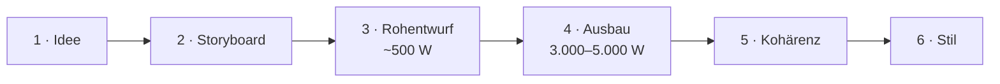

# Die Buch-Pipeline

AuthorAI erzeugt ein Buch in **sechs prüfbaren Stufen**. Jede Stufe hat ihren eigenen
Zweck, ihr eigenes Model und — bei Textstufen — einen eigenen Prüfbericht.



| # | Stufe | Model-Stage | Routen | Ergebnis |
| --- | --- | --- | --- | --- |
| 1 | Idee | — | — | Textidee + Kapitelzahl |
| 2 | Storyboard | `storyboard` | `/api/storyboard` | Struktur + Kapitelplan + Welt |
| 3 | Rohentwurf | `draft` | `/api/chapter/draft` | ~500 Wörter je Kapitel |
| 4 | Ausbau | `expand` | `/api/chapter/expand` | 3.000–5.000 Wörter je Kapitel |
| 5 | Kohärenz | `consistency` | `/api/chapter/consistency` | korrigierter Text + Bericht |
| 6 | Stil | `style` | `/api/chapter/style` | polierter Text + Bericht |

Jede Stufe ist **einzeln und wiederholbar**: einzelnes Kapitel („Ausbauen", „Kohärenz",
„Stil") oder als Queue fürs ganze Buch („Alles ausbauen", „Alle Kohärenz", „Alle Stil").
Queues persistieren **nach jedem Kapitel** und sind damit unterbrechbar/fortsetzbar.

---

## 1 · Idee

Freitext des Nutzers (Prämisse, Figur, Konflikt, Setting, Ton) plus Kapitelzahl (3–40)
und Ausgabesprache. Noch kein KI-Aufruf.

---

## 2 · Storyboard

Das Herz der Planung. Statt eines einzigen großen Aufrufs (der bei vielen Kapiteln
abgeschnitten wird) arbeitet der Server **zweiphasig**:

### Phase 1 — Outline
Ein kompakter JSON-Aufruf liefert Metadaten **und eine Liste von exakt N Kapiteltiteln**:

```
title, subtitle, genre, logline, synopsis, themes[], tone, pov,
characters[{name, role, description}],
world{locations[], factions[], magic[], artifacts[], lore[]},
chapterTitles[]   ← exakt N Einträge
```

- **Anzahl garantiert:** liefert das Modell weniger Titel, füllt der Server auf.
- **Language-Lock**: die Sprache wird im System *und* im User-Prompt erzwungen —
  inklusive Hinweis „nicht in späteren Abschnitten auf Englisch wechseln".
- **Closure-Regeln:** Drei-Akt-Verteilung, Klimax + Auflösung im letzten Kapitel,
  keine Filler.
- **Worldbuilding:** die `world`-Sektion macht Weltenbau (Ort/Fraktion/Magie/Artefakt/Lore)
  automatisch befüllbar.

### Phase 2 — Kapitel-Details in Batches (Größe 8)
Für jeden Batch werden Zusammenfassung, POV, Schauplatz, Beats und Foreshadowing erzeugt —
mit vollem Kontext (Titel, Logline, Synopsis, Figuren) **und der kompletten Titelliste**
zur Kontinuität. So bleibt jede Antwort klein (kein Truncation-Risiko) und die Sprache
konsistent.

Die Zuordnung erfolgt robust über den 1-basierten `index`, mit positionalem Fallback;
fehlt ein Eintrag, bleibt der Outline-Titel stehen — **die Kapitelzahl stimmt garantiert**.

---

## 3 · Rohentwurf (≈ 500 Wörter)

Schnelle Rohfassung je Kapitel: Beats der Reihe nach, gegebener POV, Ende auf einem Hook.
Kein Feinschliff — Ziel ist Vorwärtsbewegung.

- Prompt: „Write ONLY the chapter prose", ~500 Wörter, Sprache erzwungen.
- Ergebnis wird im Manuskript als `draft` gespeichert.

---

## 4 · Ausbau (3.000–5.000 Wörter)

Erweitert die Rohfassung zu einem vollständigen Kapitel nach **Craft-Regeln**:

- **Pacing** (Goal → Conflict → Turn), variierender Satzrhythmus
- **Show, don't tell**, sensorische Verankerung, Subtext im Dialog
- **Foreshadowing** natürlich eingewoben, distinkte Stimmen
- kein Purple Prose, keine Filler, Ende auf Hook

**Besonderheiten**

- Ziel-Länge kommt aus den **Kapitel-Zielwörtern** (Default 3.000–5.000, im Detail einstellbar).
- **Continuation-Loop:** Modelle (besonders „lite") stoppen gern zu früh. Der Server zählt
  Wörter und fordert bis zu 3× nahtlose Fortsetzungen an, bis ≥ 90 % des Ziels erreicht sind.
- **Heading-Cleanup:** führende Markdown-Überschriften/`**Kapitel 1**`-Zeilen werden entfernt.
- **Aufs Tagesziel:** erzeugte Wörter werden dem Tagesziel/Streak angerechnet.

---

## 5 · Kohärenz (Logik & Kontinuität)

Ein Continuity-Editor prüft das Kapitel gegen den **Storyboard-Kontext und die
Nachbarkapitel** und **korrigiert**:

- Widersprüche zu Synopsis, Figuren, vorherigem/nächstem Kapitel
- Timeline-, Orts- und Ursache-Wirkung-Fehler
- Figuren, die gegen Stimme/Motivation handeln
- ignoriertes/missbrauchtes Foreshadowing, Fallen gelassene Fäden

**Ausgabeformat** (strikt):

```
<TEXT>
...überarbeiteter Kapiteltext...
</TEXT>
<NOTES>
- kurzer Stichpunkt pro behobener Auffälligkeit
</NOTES>
```

**Parser-Robustheit:** Der Server nimmt alles ab `<TEXT>`, schneidet eine inline
`<NOTES>`/`NOTES:`-Sektion ab und entfernt Restmarker — auch wenn ein Modell das
schließende Tag vergisst. Führende Markdown-Überschriften fliegen ebenfalls raus.

**Chunking (Pflicht bei langen Kapiteln):** Der Pass muss die **vollständige** Prosa
zurückgeben. Bei 3.000–5.000 Wörtern sprengt das das Ausgabelimit vieler Modelle und die
Antwort bricht mitten im Kapitel ab (`finish_reason: length`). Deshalb zerlegt
`splitIntoChunks()` das Kapitel an Absatzgrenzen in Teile von **~1.000 Wörtern**
(harte Obergrenze 1.400; überlange Absätze werden an Satzgrenzen geteilt). Jeder Teil wird
einzeln überarbeitet — mit vollem Storyboard-Kontext plus den Nachbartexten als reinem
Kontext-Anker (*„do not rewrite, do not repeat"*) — und anschließend wieder zusammengesetzt.
Das Ausgabelimit pro Teil liegt bei **4.000 Tokens**, also unter dem typischen Modell-Limit.
Gibt ein Modell trotzdem das ganze Kapitel statt des Teils zurück, wird einmal nachgefasst;
danach bricht der Pass mit klarer Meldung ab (statt Text zu duplizieren). Die `<NOTES>` aller
Teile werden gesammelt und dedupliziert.

**Schutzmechanismen** (pro Teil **und** über das Gesamtkapitel)

- **Leerer Text** → Fehler (kein Datenverlust).
- **Stark gekürzt** (< 40 % der jeweiligen Länge) → Fehler, mit Teilnummer.
- **Falscher Abschnitt** (Teil-Antwort > 160 % der Teil-Länge) → einmal nachfassen.
- **Mitten im Satz** → automatische Fortsetzung (`completeProse`).
- **No-Op-Notizen** („A" wurde zu „A") → gefiltert (`lib/passNotes.ts`); die `<NOTES>`-Regeln
  im Prompt verbieten identische Vorher/Nachher-Zitate ausdrücklich.
- **Unverändert** → Hinweis im Bericht: *„Keine Textänderung erkannt — ggf. stärkeres Modell."*

Der überarbeitete Text **ersetzt** den Kapiteltext; der Bericht wird gespeichert und
`consistencyChecked = true` gesetzt — **unabhängig davon, ob Auffälligkeiten gefunden wurden**.

---

## 6 · Stil (Satzbau & Sprachgebrauch)

Ein Line-Editor poliert **ohne** Inhalt zu verändern: Satzlänge/Rhythmus, Wiederholungen,
Füllwörter, schwache Verben, Klischees, Grammatik/Punktuation/Zeitform, Dialog-Tags.
Gleiches Format, **gleiches Chunking** und gleiche Schutzmechanismen wie die Kohärenz;
Ergebnis ersetzt den Text, `styleChecked = true`.

---

## Szenen-Vorgaben & Timeline-Prüfung

**Szenen** sind die Untereinheiten eines Kapitels: Text (der Storyboard-Beat) plus Figuren,
**POV, Schauplatz, Zeit und Wortziel**. Sie sind im Buch-Editor pflegbar und werden bei
Rohentwurf, Ausbau, Kohärenz und Stil als **verbindlicher Block** mitgeschickt:

```
SCENES (binding — follow in this order):
1. Der Aufbruch am Hafen
   POV: Kiro · Setting: Alt-Distrikt · Time: Tag 1, Morgen · Target: ~800 words
   Characters present: Kiro, Sylar
```

Die System-Prompts fordern: Reihenfolge halten, POV/Schauplatz/Zeit je Szene einhalten,
jede gelistete Figur in ihrer Szene auftreten lassen und das Wortziel berücksichtigen.

**Timeline-Prüfung** (`POST /api/timeline/check`) liest dieselben Angaben für das ganze Buch
und meldet chronologische Probleme (Rückwärtssprünge, unplausible Reise-/Vorbereitungszeiten,
Tag/Nacht, Daten/Dauern, fehlende Zeiten). Ergebnis: Kurzfassung + Befundliste im Buch-Header.
Sie nutzt das **Kohärenz-Model**.

---

## Prüfberichte & Status

- Berichte liegen am Kapitel: `consistencyNotes`, `styleNotes` (zeilenweise).
- Status-Flags: `consistencyChecked`, `styleChecked`.
- Sichtbar als **farbige Plates** in der Kapitel-Liste (Kohärenz violett, Stil rose) sowie
  im aufklappbaren Bereich **„Prüfberichte"** (mit „Keine Auffälligkeiten.", falls sauber).

---

## Kanon: Fakten & Beziehungen (verbindlich für alle Pässe)

Prüf-Pässe lesen sonst Text gegen Text — das Modell muss Widersprüche selbst *erkennen*. Mit dem
**Kanon** werden Fakten und Beziehungen einmal explizit erfasst und jedem Aufruf als harter Block
mitgegeben (`lib/continuity.ts` → `canonBlock()`, erzeugt in `BookDetailView`):

```
CANON FACTS (binding — never contradict these; if the text does, name the fact and chapter in <NOTES>):
- [Seraphine] (vergangenheit) Verlor ihre Schwester unter ungeklärten Umständen. (Kapitel 2)
- [WORLD: Aschekrone] (regel, hard) Magie kostet Lebenszeit. (Kapitel 4)

RELATIONS (binding — keep these dynamics consistent):
- Seraphine → Kael: distrust (−0,6) — seit dem Verrat im Hafen (Kapitel 5)
```

- **Wo**: `chapter/draft`, `chapter/expand`, `chapter/consistency`, `chapter/style` und
  `timeline/check` (Feld `canon`) — im Buch-Editor **und** im Buch-Wizard (dort der Kanon der
  **Vorbände**, wenn das Buch als Band einer Reihe entsteht).
- **Reihe**: `seriesContext` geht zusätzlich an `POST /api/storyboard` (Titel, Handlung, Figuren
  und Schauplätze der Vorbände + „fortführen, nicht neu erzählen") — siehe
  `lib/seriesContext.ts`.
- **Geltungsbereich**: nur Entitäten des Projekts (Figuren mit `bookId` bzw. Namen aus dem
  Storyboard, Welteneinträge mit `bookId`) — kein Kanon aus anderen Büchern. Gehört das Buch zu
  einer **Reihe**, umfasst der Scope **alle Bände** (`canonVolumeIds`): gemeinsame Welt,
  Figuren-Historie und Fakten über die Bände hinweg.
- **Leer = kein Block**: ohne Fakten/Beziehungen taucht der Block nicht auf (kein toter Header).
- **Quelle**: manuell (Charakter-Editor → Panels „Fakten“/„Beziehungen“) oder
  `POST /api/continuity/extract` mit Review-Dialog.

**Fakten-Check & Quick Fix**

- **Einzelprüfung**: `POST /api/continuity/check` prüft ein Kapitel nur gegen den Kanon und
  nennt Fakt, Zitat und Lösungsvorschlag. Gecacht — identische Prüfung kostet nichts.
- **Queue mit Live-Ergebnissen**: `POST /api/continuity/check/stream` prüft alle Kapitel
  **parallel** (Standard 3 gleichzeitig, `concurrency` bis 6) und schickt jedes Ergebnis als
  SSE-Ereignis. Die Ergebnisliste füllt sich also während des Laufs; ein fehlerhaftes Kapitel
  beendet den Lauf nicht. Sequenziell wäre die Wartezeit die Summe aller Kapitel.
- **Quick Fix**: `POST /api/continuity/repair` behebt gemeldete Widersprüche. Ans Modell gehen
  **nur die Textteile, in denen ein gemeldetes Zitat wirklich vorkommt** — der Rest bleibt
  wortgleich (spart Aufrufe, verhindert unnötiges Umschreiben). Gleiche Sicherungen wie bei den
  Pässen: Ausgabelimit am Teil, `finish_reason: "length"` → Korrektur **verwerfen**, Antwort
  über ~⅓ länger → verwerfen. Die Oberfläche prüft das Kapitel danach **erneut** und zeigt, was
  übrig bleibt.

---

## Ableitungen (Figuren & Weltenbau)

Beide Ableitungen sind **nachgelagerte Werkzeuge** — sie laufen nicht im Wizard, sondern
werden in der jeweiligen Ansicht angestoßen und nutzen das **Storyboard-Modell**.

| Ableitung | Quelle | Route | Ergebnis |
| --- | --- | --- | --- |
| **Weltenbau** | Storyboard | `POST /api/world/extract` | Orte, Fraktionen, Magie, Artefakte, Lore |
| **Figuren** | **Manuskript** | `POST /api/characters/extract` | benannte Figuren (Name, Rolle, Beschreibung) |

**Warum Figuren aus dem Manuskript?** Die Storyboard-Figuren entstehen aus der *Idee* — Figuren,
die erst beim Schreiben auftauchen (Nebenfiguren, Auftraggeber, Gegenspieler), kennt es nicht.
Die Extraktion liest deshalb die Kapiteltexte: pro Kapitel der **Anfang** (dort werden Figuren
eingeführt), Gesamtbudget ~60k Zeichen gleichmäßig verteilt — so werden auch spät auftauchende
Figuren erfasst. Bereits getrackte Namen werden serverseitig herausgefiltert.

Die Vorschläge landen in einem **Review-Dialog** (einzeln an-/abwählbar) und werden erst nach
Bestätigung zu Charakteren (Tag „Manuskript", verknüpft mit dem Projekt).

**Dublettenschutz beim Weltenbau:** Jeder Scan bekommt die bereits getrackten Einträge
(`knownEntries`) mitgeschickt und soll sie nicht erneut liefern; der Server filtert sie
zusätzlich aus der Antwort. Clientseitig prüft `lib/worldMatch.ts` jeden Vorschlag auf
Titel-Ähnlichkeit (normalisiert: Artikel/Case/Umlaute egal, plus Token-Überlappung) — Treffer
sind im Review-Dialog vorab **abgewählt** und als „ähnlich zu …" markiert. Bestehende
Dubletten räumt **„Dubletten entfernen"** in der Weltenbau-Ansicht auf (behält je Konzept den
ersten Eintrag; Bestätigung vor dem Löschen).

---

## Modellwahl (Empfehlung)

| Stufe | Anspruch | Hinweis |
| --- | --- | --- |
| Storyboard | hoch (Struktur, Sprache) | stärkeres Modell lohnt |
| Rohentwurf | niedrig | schnelles/„lite" Modell reicht |
| Ausbau | mittel–hoch | Continuation-Loop fängt Länge ab |
| Kohärenz | hoch (Reasoning) | stärkeres Modell empfohlen |
| Stil | mittel | Sprachgefühl wichtiger als Größe |

Modelle werden **pro Stufe** gesetzt (freie OpenRouter-ID). Leer = erbt das Standard-Model.

---

## Speichern & Weitermachen

- **Zwischenspeichern** ist auf jeder Textstufe möglich (Steps 2–6) → Buch landet in der
  Bibliothek, Wizard schließt.
- Später im **Buch-Editor** einzeln weitergenerieren (`Rohentwurf`, `Ausbauen`, `Kohärenz`, `Stil`)
  oder als Queue.
- **Schließen ohne Speichern** fragt nach (X / Abbrechen / Escape).

---

## Fehlerverhalten

- Klare, deutsche Fehlermeldungen aus dem Server (`ApiError` → HTTP-Status + `{ error }`).
- Abgebrochene Queues melden die Kapitelnummer; bereits fertige Kapitel bleiben erhalten.
- Fehlende Keys/Modelle werden vor dem Aufruf geprüft und benannt.
