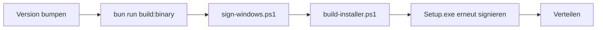

# Release & Auslieferung (Windows)

Wie aus dem Repository eine **versandfertige** Anwendung wird: Binary bauen,
signieren, Installer erzeugen, verteilen.



Alles landet im (gitignorierten) Ordner **`release/`**.

---

## Voraussetzungen

| Was | Wofür | Pflicht |
| --- | --- | --- |
| **Bun** ≥ 1.3 | Build des Standalone-Binaries | ✅ |
| **Inno Setup 6** ([Download](https://jrsoftware.org/isdl.php)) | Setup.exe bauen | für Installer |
| **Windows SDK** (Signing Tools → `signtool.exe`) | Signieren | für Signatur |
| **Code-Signing-Zertifikat** (OV oder EV) | Vertrauen/SmartScreen | für Signatur |

> Ohne Zertifikat funktioniert alles trotzdem — Windows zeigt beim Start aber
> „Unbekannter Herausgeber" (SmartScreen).

---

## 1 · Version bumpen

Ein Befehl schreibt **alle** Stellen und prüft danach nach:

```powershell
bun run version:bump 0.4.1          # Zielversion
bun run version:bump patch          # major | minor | patch
bun run version:bump 0.4.1 --dry-run   # nur zeigen, nichts schreiben
bun run version:bump 0.4.1 --force     # auch rückwärts (Downgrade)
```

Das Skript (`scripts/version.ts`) hält sechs Stellen konsistent:

1. `package.json` → `version`
2. `packages/promptgen/package.json` → `version` (Workspace-Paket, gleiche Version)
3. `installer/authorai.iss` → `#define MyAppVersion`
4. `installer/authorai.nsi` → `!define APP_VERSION` **und** `VIProductVersion` (`x.y.z.0`)
5. `README.md` / `docs/README.md` → Versionszeile
6. `docs/changelog.md` → **[Unreleased] wird zum Release**, oben entsteht ein frischer
   Platzhalter (enthält `[Unreleased]` nur den Platzhalter, bleibt das Changelog unberührt —
   es entsteht kein leerer Release)

Passt ein Muster nicht mehr (Define umbenannt, Zeile entfernt), **bricht das Skript ab, ohne
etwas zu schreiben** — so kann keine Stelle stillschweigend driften.

> Nicht verwechseln: `META_VERSION` (`data/author.ts`) und `BACKUP_VERSION` (`lib/backup.ts`)
> sind **Datenformat-Versionen** und haben mit der App-Version nichts zu tun. Sie werden vom
> Skript bewusst nicht angefasst.

Repository: <https://github.com/KT-Society/AuthorAI>

---

## 2 · Release bauen

Am einfachsten mit dem Ein-Befehl-Skript:

```powershell
pwsh -File scripts/release.ps1                 # nur Binary
pwsh -File scripts/release.ps1 -Installer      # + Setup.exe
pwsh -File scripts/release.ps1 -Sign -Installer
```

Oder einzeln:

```powershell
bun run build:binary
```

Ergebnis:

```
Release/
├─ authorai.exe                        # Server + UI (eine Datei)
├─ LICENSE                             # MIT — bei Weitergabe Pflicht
├─ README.md
├─ .env.example
└─ AuthorAI-Setup-<version>.exe        # nur mit -Installer
```

**Verhalten des Binaries**
- Startet den Server (Standard-Port **3000**, `PORT` überschreibbar).
- Öffnet im Standalone-Betrieb automatisch den Browser (`AUTHORAI_OPEN=0` schaltet das ab).
- Liest Keys aus `.env` **neben dem Binary** oder aus Umgebungsvariablen.
- Legt erzeugte Cover in `covers/` und die Datenbank in `data/authorai.db` beim Binary ab.

---

## 3 · Signieren (Code-Signing)

Warum: Windows SmartScreen blockt unbekannte EXEs. Signierte Dateien zeigen einen
Herausgeber-Namen; mit **EV-Zertifikaten** ist das Vertrauen sofort da,
**OV-Zertifikate** bauen Reputation erst über Downloads auf.

> **Signierung ist optional.** Ohne konfiguriertes Zertifikat wird sie automatisch
> übersprungen (mit Hinweis) — der Rest des Releases läuft normal weiter.

```powershell
# mit PFX-Datei
$env:AUTHORAI_PFX          = "C:\pfx\authorai.pfx"
$env:AUTHORAI_PFX_PASSWORD = "…"
pwsh -File scripts/sign-windows.ps1

# oder mit Zertifikat im Speicher
pwsh -File scripts/sign-windows.ps1 -Thumbprint <SHA1>
```

Das Skript signiert jede `.exe` in `release/` (SHA-256 + Zeitstempel) und
verifiziert anschließend mit `signtool verify /pa`.

**Reihenfolge:** erst das Binary signieren, dann den Installer bauen, dann den
Installer signieren — so steckt im Setup eine signierte Anwendung.

---

## 4 · Installer bauen

```powershell
pwsh -File scripts/build-installer.ps1
```

`installer/authorai.iss` (Inno Setup 6) macht daraus ein Setup, das:

- **pro Nutzer** installiert (`%LOCALAPPDATA%\Programs\AuthorAI`) → **kein UAC**
- **Start-Menü**-Eintrag und optional eine **Desktop-Verknüpfung** anlegt
- beim ersten Install eine **`.env`** aus `.env.example` erzeugt (Keys eintragen!)
- die **MIT-Lizenz** im Setup anzeigt
- beim Deinstallieren fragt, ob **Cover + `.env`** entfernt werden sollen
  (Bücher/Charaktere liegen in `data/authorai.db` und bleiben erhalten)

Nach dem Installer-Bau noch einmal signieren (siehe Schritt 3).

> ⚠️ **Lizenzhinweis zu Inno Setup (wichtig, wenn du verkaufst)**
> Inno Setup ist urheberrechtlich geschützt; der Compiler meldet „Non-commercial use only"
> und die Projektseite bittet **kommerzielle Nutzer ausdrücklich um eine Lizenz**
> („Using Inno Setup commercially? Please purchase a license.").
>
> Drei saubere Wege für einen kommerziellen Vertrieb:
> 1. **Portable ZIP** aus `release/` — kein Installer-Tool, keine Lizenzfrage
>    (Single-Binary startet sich bequem selbst; empfohlen zum Start),
> 2. **NSIS** (zlib-Lizenz, kommerziell frei) — Installer-Skript ist schnell ergänzt,
> 3. **Inno-Setup-Commercial-Lizenz** erwerben.
>
> Das Skript `installer/authorai.iss` bleibt im Repo und ist für nicht-kommerzielle
> Nutzung sofort einsatzbereit.

---

## 5 · Verteilen

| Weg | Hinweis |
| --- | --- |
| **Portable ZIP** aus `release/` | Kein Installer nötig, keine Lizenzfrage — Single-Binary startet sich selbst. **Empfohlen zum Start.** |
| **Setup.exe** (Inno Setup) | Ein Doppelklick, Shortcuts, saubere Deinstallation — siehe Lizenzhinweis in Schritt 4 |
| Shops (Gumroad, Paddle, eigener Shop) | Lizenz-/Rechnungsstellung über den Shop; Datei als Download |

Grundsatz: **`release/` enthält alles, was der Kunde braucht** — inklusive Lizenz.

---

## Checkliste vor der Veröffentlichung

- [ ] Versionsnummer in `package.json`, `installer/authorai.iss`, `installer/authorai.nsi`
      (inkl. `VIProductVersion`) und `docs/changelog.md` gleich
- [ ] `bun run check` grün
- [ ] `bun run build:binary` ohne Warnungen
- [ ] Probe-Lauf: Binary in einem **leeren Ordner** starten, `.env` daneben, App öffnet sich
- [ ] Keys getestet: Recherche, Generierung, Cover (mindestens ein Aufruf je Dienst)
- [ ] `release/` enthält `LICENSE`, `README.md`, `.env.example`
- [ ] Alle `.exe` signiert (`signtool verify /pa` ohne Fehler)
- [ ] Setup auf einem **sauberen Windows** installiert/getestet, Deinstallation geprüft
- [ ] Keine Secrets in Build-Artefakten oder Logs

---

## Troubleshooting

| Symptom | Ursache / Lösung |
| --- | --- |
| „Unbekannter Herausgeber" / SmartScreen | Binary nicht signiert — Schritt 3 (EV-Cert = sofort vertrauenswürdig) |
| `Inno Setup 6 nicht gefunden` | Inno Studio installieren oder `iscc.exe` in den PATH legen |
| Inno meldet „Non-commercial use only" | Lizenzhinweis in Schritt 4 — für Verkauf ZIP/NSIS wählen oder Inno-Lizenz kaufen |
| `Invalid prototype for 'InitializeUninstall'` | Behoben: `InitializeUninstall` muss eine `function … : Boolean` sein |
| `signtool.exe nicht gefunden` | Windows SDK → „Signing Tools" nachinstallieren |
| Binary findet Keys nicht | `.env` **neben** die `.exe` legen (oder Umgebungsvariablen setzen) |
| Port 3000 belegt | `PORT=3001` setzen |
| Release „verschwunden" | Nicht nach `dist/` legen — `bun run build` leert dieses Verzeichnis. Richtig ist `release/` |
